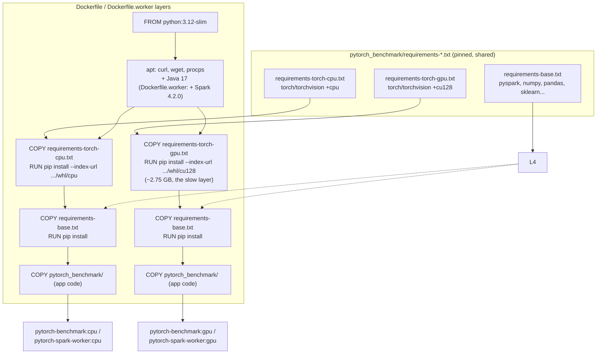
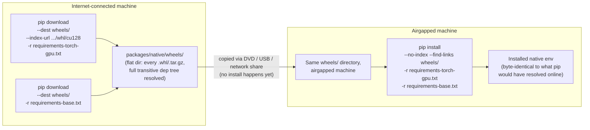

# Build, Ship, and Reproduce — Reference

What each Docker image is for, what every `.bat`/`.sh` script does, how the
build and airgap-shipping pipelines actually flow, and why the result is
reproducible on a machine with no internet access. Companion docs:
[CLUSTER_SETUP.md](CLUSTER_SETUP.md) (multi-node native topology),
[airgap/README.md](airgap/README.md) (step-by-step transfer walkthrough),
[airgap/ARCHITECTURE.md](airgap/ARCHITECTURE.md) (audit/history),
[airgap/TESTING.md](airgap/TESTING.md) (pre-transfer test checklist),
[cluster/native/DOWNLOAD.md](cluster/native/DOWNLOAD.md) (installing the
native packages on a Windows or Linux dev/test box with internet access).

---

## 1. The four Docker images

| Image | Built from | Base | Purpose |
|---|---|---|---|
| `pytorch-benchmark:cpu` | `Dockerfile` target `cpu` | `python:3.12-slim` | Standalone single-container benchmark runner, CPU-only torch. Used by `docker-compose.yml`'s `benchmark-cpu`, `benchmark-quick` services. |
| `pytorch-benchmark:gpu` | `Dockerfile` target `gpu` | `python:3.12-slim` + CUDA 12.8 torch wheel | Standalone single-container benchmark runner with GPU. Used by `benchmark-gpu`, `inference-resnet50/mobilenet/distilbert/all` services. |
| `pytorch-spark-worker:cpu` | `Dockerfile.worker` target `cpu` | `python:3.12-slim` | Spark + CPU torch, standalone Spark install at `/opt/spark`. Built and tagged by `save_docker_images.bat`'s sibling script scope, but **not referenced by `docker-compose.yml`** — available for manual/future CPU-only cluster use, not part of the current shipped pipeline. |
| `pytorch-spark-worker:gpu` | `Dockerfile.worker` target `gpu` | `python:3.12-slim` + CUDA 12.8 torch wheel | Does triple duty in `docker-compose.yml`'s cluster mode: it's the image for `spark-master`, `spark-worker-1`/`spark-worker-2` (running `start-master.sh`/`start-worker.sh`), **and** `benchmark-cluster` (same image, entrypoint overridden to `pytorch_benchmark.cluster_benchmark`). Even the "master" role runs this GPU-tagged image — CUDA just isn't touched by the master process. |

**Why no separate CUDA base image anymore:** the `torch==...+cu128` wheel
bundles its own CUDA/cuDNN/cuBLAS/NCCL runtime libraries (that's the
~2.75 GB you saw download). GPU access at `docker run --gpus all` time
comes from the NVIDIA Container Toolkit (Linux) or Docker Desktop
(Windows) mounting the *host* driver into the container — that's
independent of what base image you started from. Dropping
`nvidia/cuda:*-runtime` in favor of `python:3.12-slim` removed a 10-15
minute from-source Python compile and a large chunk of image size, with no
functional loss.

---

## 2. Every script, what it does, where it runs

### Root

| Script | Runs on | Does |
|---|---|---|
| `rebuild.bat` | Windows | Builds all 4 Docker images (cache-aware — no `--no-cache`), then auto-detects GPU vs CPU on this machine and refreshes the **native** Python env to the matching pinned versions. `-docker-only` flag skips the native part. |
| `rebuild.sh` | Linux/macOS | Same 4 Docker builds only — no native step, because there's no native Linux install path (§5). |
| `test_docker.bat` | Windows | Starts `spark-master` + `spark-worker-1` + `spark-worker-2` as containers, waits 20s for registration, runs the `benchmark-cluster` driver, then stops the cluster. Closest single-machine proxy for the real distributed topology. |
| `test_native.bat` | Windows | Runs `pytorch_benchmark.cluster_benchmark` in Spark `local[*]` mode — no master/worker needed, exercises native Python + GPU torch together in one process. |

### `cluster/native/` — multi-node native (non-Docker) cluster

| Script | Runs on | Does |
|---|---|---|
| `install_gpu_worker.bat` | Every GPU machine | `pip install`s the pinned `requirements-torch-gpu.txt` (torch/torchvision `+cu128`) then `requirements-base.txt`, into whatever `python`/`pip` is first on `PATH`. |
| `start_master.bat` | Node 1 (driver machine) | Starts a real standalone Spark **Master** process on the LAN, using Spark binaries bundled inside the installed `pyspark` package (no separate Spark download needed). |
| `start_worker.bat` | Node 2, 3, ... | Runs `check_gpu.py` as a preflight, then starts a Spark **Worker** process pointed at the master's `spark://IP:7077`. Pins `PYSPARK_PYTHON` explicitly — the #1 cause of "GPU silently becomes CPU" is Spark launching tasks under a different, CPU-only Python. |
| `run_benchmark.bat` | Node 1 (driver) | Sets cluster connection env vars, runs the GPU preflight, then `pytorch_benchmark.cluster_benchmark` followed by `generate_cluster_report`. |
| `download_spark.py` (Python, not `.bat`) | Optional | Downloads a **standalone** `spark-4.2.0-bin-hadoop3.tgz` to `cluster/native/spark/`. Not needed for the scripts above (they use `pyspark`'s bundled Spark) — this exists for the airgap kit, which needs an actual `.tgz` file to ship and extract offline (§4). |

### `airgap/` — the shipping pipeline, in run order

**On the internet-connected machine:**

| Order | Script | Does |
|---|---|---|
| 1 | `download_all.bat` | `pip download`s (not install) the pinned GPU wheel set + base deps into `packages/native/wheels/`; downloads `spark-4.2.0-bin-hadoop3.tgz`, the Windows Java 17 JRE zip, and NVIDIA Container Toolkit RPMs (for Linux Docker GPU passthrough later). |
| 2 | `save_docker_images.bat` | Builds `pytorch-spark-worker:gpu`, `pytorch-benchmark:gpu`, `pytorch-benchmark:cpu` (cache-aware), then `docker save \| gzip`s them into `packages/docker/gpu-images-combined.tar.gz` and `pytorch-benchmark-cpu.tar.gz`. |
| 3 | `split_for_dvd.bat` | Splits the (large) GPU tar into 4.3 GB chunks via `tests/split_file.py`, and lays out `dvd/disc1/`, `disc2/`, `disc3/` — disc3 also gets the CPU tar, wheels, Spark tgz, Java, Container Toolkit RPMs, and a copy of the project source (`tests/copy_project.py`). Only needed if you're actually burning physical DVDs — for a USB drive or network transfer, just copy `airgap/packages/` directly and skip this step. |

**On the airgapped machine:**

| Order | Script | Runs on | Does |
|---|---|---|---|
| 4 | `reassemble_dvd.bat` | Windows only | Prompts for the folder the 3 DVDs were copied into, reassembles the GPU tar from its chunks (`tests/reassemble_file.py`), copies disc3's contents back into a `packages/` layout, then **automatically calls** `install_native.bat` and `load_docker_images.bat` for you. |
| 5 | `install_native.bat` | Windows only | Detects a local Python 3.12, extracts the portable Java JRE zip and the Spark tgz into `cluster/native/{java,spark}`, `pip install`s from the local wheel directory with `--no-index --find-links` (zero network calls), then patches the extracted `JAVA_HOME` path into `run_benchmark.bat`/`start_master.bat`/`start_worker.bat`. |
| 6 | `load_docker_images.bat` | Windows (also works via plain `docker load -i` on Linux) | `docker load`s every `*.tar`/`*.tar.gz` in `packages/docker/`. |
| 7a | `simulate_airgap_test.bat` | Windows | 10 checks (5 native + 5 Docker), all with `--no-index`/`--network none` — see [TESTING.md](airgap/TESTING.md). |
| 7b | `simulate_airgap_test.sh` | Linux | The 5 Docker-only checks (no native section — Linux has no native path). |
| 8 | `container_toolkit/install_offline.sh` | Linux/RHEL only | Installs the NVIDIA Container Toolkit RPMs, configures the Docker runtime, restarts Docker — needed for `--gpus all` to work on Docker Engine (Docker Desktop on Windows doesn't need this). |

---

## 3. Docker build flow

**Why the layer order matters:** each `RUN pip install` is preceded by its
own narrow `COPY` of just the one requirements file it needs. Docker's
build cache invalidates a layer only when its own instruction or the files
it `COPY`s change — so bumping `pandas` in `requirements-base.txt`
invalidates *only* the base-deps layer; the multi-minute torch layer stays
`CACHED`. Verified in this repo: rebuilding with no changes takes ~2s (full
cache hit); bumping one line in `requirements-base.txt` re-ran only that
layer (~100s) while the ~90s torch layer stayed `CACHED`.

---

## 4. How native packages are downloaded (and why it's different from a normal `pip install`)

The airgap kit doesn't just "install" packages on the internet machine and
copy them over — venvs and site-packages aren't portable that way, and it
wouldn't survive a different Python patch version. Instead:

`pip download` (step on the internet machine) does real dependency
resolution — it walks the full tree (`pyspark`'s `py4j`, `pandas`'s
`python-dateutil`/`pytz`/`tzdata`, `scikit-learn`'s `scipy`/`joblib`, etc.)
and downloads every wheel/sdist actually needed, not just the top-level
ones you named. That's what makes `wheels/` self-contained: it's not "the
packages I asked for," it's "everything `pip install` would have fetched."

`pip install --no-index --find-links wheels/` (step on the airgapped
machine) then resolves against **only** that local directory — `--no-index`
means it never attempts to contact PyPI or download.pytorch.org, so there's
no failure mode where it "almost" works offline. If a dependency is
missing from `wheels/`, this step fails loudly and immediately, rather than
silently hitting the network (which wouldn't exist anyway on the real
target).

---

## 5. Shipping

| Artifact | Format | Carries |
|---|---|---|
| `packages/docker/gpu-images-combined.tar.gz` | gzip'd `docker save` output | `pytorch-spark-worker:gpu` + `pytorch-benchmark:gpu`, shared CUDA/base layers deduplicated |
| `packages/docker/pytorch-benchmark-cpu.tar.gz` | gzip'd `docker save` output | `pytorch-benchmark:cpu` |
| `packages/native/wheels/` | flat `.whl`/`.tar.gz` directory | Full resolved dependency tree for native Python 3.12 install |
| `packages/native/spark/spark-4.2.0-bin-hadoop3.tgz` | Apache Spark release tarball | Standalone Spark, extracted by `install_native.bat` |
| `packages/native/java/*.zip` | Temurin JRE 17.0.11+9, Windows only | Extracted by `install_native.bat`; no Linux native equivalent (§ below) |
| `packages/container_toolkit/*.rpm` | RHEL 8/9 x86_64 RPMs | NVIDIA Container Toolkit — Linux Docker GPU passthrough only |
| `dvd/disc1-3/` | Same files, chunked to ≤4.3 GB | Only needed for physical DVD transfer; skip and copy `packages/` directly for USB/network transfer |

**Linux gets Docker images + Container Toolkit RPMs only** — there is no
native (non-Docker) Linux install path in this kit, by deliberate design
(see [airgap/ARCHITECTURE.md](airgap/ARCHITECTURE.md)). `install_native.bat`,
`reassemble_dvd.bat`, `load_docker_images.bat`, and `simulate_airgap_test.bat`
are all Windows batch scripts with no Linux equivalent for the native path;
`simulate_airgap_test.sh` covers the Docker-only Linux verification.

---

## 6. Reproducibility on an airgapped system

**What's pinned, and why that's the whole guarantee:**

`pytorch_benchmark/requirements-base.txt`, `requirements-torch-cpu.txt`,
and `requirements-torch-gpu.txt` are the single source of truth, consumed
identically by six separate build paths: `Dockerfile` CPU, `Dockerfile`
GPU, `Dockerfile.worker` CPU, `Dockerfile.worker` GPU, native online
install, and native airgap install. Every package in them is pinned to an
**exact** version (`torch==2.11.0+cu128`, `pyspark==4.2.0`, ...) — not a
floor (`>=`) or a range. Combined with `pip download`'s full-tree
resolution (§4), this means:

- The `wheels/` directory captured today, installed via `--no-index` a
  year from now, produces the identical environment — there's no live
  index to consult, so there's no way for a newer transitive dependency to
  sneak in.
- Docker images rebuilt from the same pinned files on a different day
  produce the same `pip`-installed layer contents, because the exact
  versions (not ranges) are what's being resolved.
- Native and Docker are on the *same* versions as each other, not just
  internally consistent — so a benchmark number from a native Windows run
  and a Docker run are comparable.

**What's *not* pinned (the honest gap):** `apt-get install curl wget
procps` in `Dockerfile`/`Dockerfile.worker`, and the RHEL RPM dependency
resolution in `fetch_toolkit_rpms_on_rhel.sh`, both pull whatever's current
in their respective repos at build time. This is a minor, low-risk gap —
none of those packages affect benchmark behavior — but it means the Docker
base layer isn't bit-for-bit reproducible across build dates the way the
Python dependency layers are. Java (`17.0.11+9`, fixed download URL) and
Spark (`4.2.0`, fixed download URL) **are** pinned exactly, same as the
Python packages.
