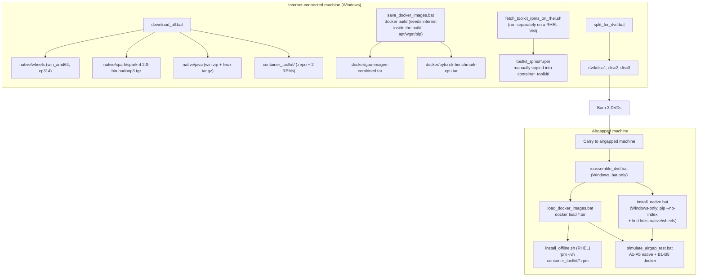

# Airgap Package Architecture

Audit of `airgap/` — what's packaged, how it's built/transferred, and whether it
actually works on both the Windows and Linux (RHEL) airgapped targets the
README describes.

**Bottom line up front:** the **native (non-Docker) install path only works on
Windows**. There is no Linux native install path despite the README walking
through "AIRGAPPED machine (RHEL)" steps. On Linux, **Docker is the only
viable path**. Details below.

> **Status (2026-08-05): items 3, 4, 5 below are fixed.** Python is now
> pinned to 3.12 everywhere (Docker CPU/GPU, native, Dockerfile.worker); the
> GPU stages install stable `torch==2.11.0+cu128` / `torchvision==0.26.0+cu128`
> from `pytorch_benchmark/requirements-torch-gpu.txt` instead of unpinned
> `--pre` nightlies; and native/Docker now share the same pinned dependency
> files (`pytorch_benchmark/requirements-base.txt`,
> `requirements-torch-cpu.txt`, `requirements-torch-gpu.txt`), so the version
> table in §4 is no longer accurate for a rebuild done today. §1 recommendation
> was taken deliberately as **Docker-only on Linux** (item 2 below) rather than
> adding a Linux native path — the README's RHEL steps have been corrected to
> say so instead of implying native support. The rest of this document is kept
> as the original audit for historical context.

---

## 1. What's in `airgap/packages/`

| Folder | Contents | Platform tag |
|---|---|---|
| `native/wheels/` | 39 Python wheels/sdists (torch, pyspark, numpy, pandas, scikit-learn, matplotlib, etc.) | **`cp314-cp314-win_amd64`** for every compiled package |
| `native/spark/` | `spark-4.2.0-bin-hadoop3.tgz` | Platform-independent (JVM) |
| `native/java/` | Windows JRE `.zip` **and** Linux JRE `.tar.gz` | Both present, but see §4 — Linux one is unused by any script |
| `container_toolkit/` | `nvidia-container-toolkit.repo`, 2 `libnvidia-container*.rpm`, `fetch_toolkit_rpms_on_rhel.sh`, `install_offline.sh` | RHEL 8/9 x86_64 only |
| `docker/` | `gpu-images-combined.tar`, `pytorch-benchmark-cpu.tar` | Linux containers (run on either Docker Desktop/Windows or Docker Engine/Linux) |

### Wheel platform breakdown (`native/wheels/`)

| Type | Packages | Portable? |
|---|---|---|
| Compiled, Windows-only (`win_amd64`, `cp314`/`cp37-abi3`) | torch, torchvision, numpy, pandas, scipy, scikit-learn, matplotlib, pillow, contourpy, fonttools, kiwisolver, psutil, markupsafe | ❌ Linux install will fail — no matching wheel |
| Pure Python (`py3-none-any`) | jinja2, mpmath, packaging, six, sympy, threadpoolctl, typing_extensions, tzdata, narwhals, networkx, joblib, cycler, pyparsing, python_dateutil, filelock, fsspec, setuptools, tabulate | ✅ OS-independent |
| Pure-Python sdist (`.tar.gz`, no C extensions) | pyspark, GPUtil, py4j | ✅ OS-independent |

Every package that actually matters for the benchmark (torch, numpy, pandas,
scikit-learn, matplotlib, psutil) is a **compiled Windows wheel**. There is no
`manylinux` wheel set anywhere in the repo or download scripts.

---

## 2. Build/transfer pipeline

Key detail: **Docker images are built with live internet access** (Dockerfile
and Dockerfile.worker `wget`/`apt-get`/`pip install` straight from
python.org, GitHub, PyPI, download.pytorch.org). The airgap kit exports the
*already-built* images as tars — it never rebuilds them offline. So the
`native/java`, `native/spark`, and `native/wheels` packages are **not** what
the Docker images use; each Docker stage downloads its own Java/Spark/Python
independently at build time. This means the native package set and the
Docker image contents are two entirely separate, independently-versioned
dependency trees (see §5).

---

## 3. Deployment paths

| Path | Where it runs | What it needs | Status |
|---|---|---|---|
| **Native** | Windows only | Python 3.14 pre-installed + `native/wheels`, `native/spark`, `native/java` (Windows zip) | ✅ Works, Windows only |
| **Native** | Linux (RHEL) | Same wheels — but they're `win_amd64` | ❌ Cannot work — no Linux wheels exist, no `install_native.sh` |
| **Docker** | Windows (Docker Desktop + WSL2) | `docker/*.tar` loaded via `load_docker_images.bat`; GPU passthrough via Docker Desktop, no Container Toolkit needed | ✅ Works |
| **Docker** | Linux (RHEL + Docker Engine) | `docker/*.tar`; GPU passthrough via NVIDIA Container Toolkit RPMs (`container_toolkit/`) | ✅ Works — this is the *only* GPU-capable path on Linux |

### Why "airgapped RHEL" in the README is misleading

The README's Steps 6–10 describe copying DVDs to a RHEL machine, but:

- `reassemble_dvd.bat`, `install_native.bat`, `load_docker_images.bat`,
  `simulate_airgap_test.bat` are all **Windows batch (`.bat`) scripts** —
  none of them run on RHEL directly (no `.sh` equivalents exist).
- `install_native.bat` searches only for Windows Python install paths and
  extracts a **Windows JRE `.zip`** with `zipfile` — it has no Linux branch.
- Consequently, on a RHEL airgapped machine, the *only* thing in this kit
  that actually executes is `container_toolkit/install_offline.sh` (Step 8)
  and `docker load` (Step 9, which you'd invoke manually since
  `load_docker_images.bat` won't run either). The Linux Java tarball
  (`OpenJDK17U-jre_x64_linux_hotspot_17.0.11_9.tar.gz`) is downloaded by
  `download_all.bat` but **nothing in the repo ever extracts or references
  it** — it rides along on the DVDs unused.

---

## 4. Version consistency across the three built environments

Three independent dependency trees exist: native Windows wheels, the
`pytorch-benchmark` image (`Dockerfile`), and the `pytorch-spark-worker`
image (`Dockerfile.worker`). They do **not** match each other:

| Component | Native (`native/wheels`) | `Dockerfile` CPU target | `Dockerfile` / `Dockerfile.worker` GPU target | `Dockerfile.worker` CPU target |
|---|---|---|---|---|
| Python | 3.14 (cp314 tag) | **3.11** (`python:3.11-slim`) | 3.14 (built from source) | **3.14** (`python:3.14-slim`) |
| torch | 2.13.0, **no `+cu128` suffix** — looks CPU-only despite nightly-cu128 index (§4a) | 2.3.0, CPU wheel (pinned) | unpinned `--pre` nightly cu128 (whatever's latest at build time) | unpinned `--pre` nightly cu128 |
| numpy | 2.5.1 (unpinned/latest) | 1.26.4 (pinned) | unpinned (latest at build time) | unpinned |
| pandas | 3.0.5 (unpinned) | 2.2.1 (pinned) | unpinned | unpinned |
| scikit-learn | 1.9.0 (unpinned) | 1.4.2 (pinned) | unpinned | unpinned |
| matplotlib | 3.11.1 (unpinned) | 3.8.4 (pinned) | unpinned | unpinned |
| pyspark | 4.2.0 (pinned) | 4.2.0 (pinned) | 4.2.0 (pinned) | 4.2.0 (pinned) |
| Java | 17.0.11+9 (Temurin) | 17.0.11+9 (Temurin) | 17.0.11+9 (Temurin) | 17.0.11+9 (Temurin) |
| Spark | 4.2.0-bin-hadoop3 | n/a (no Spark in cluster deploy) | 4.2.0-bin-hadoop3 | 4.2.0-bin-hadoop3 |

**Implications:**

- **Python version drift**: `pytorch-benchmark:cpu` runs Python 3.11 while
  every other environment (native, worker images) runs 3.14. That's the one
  most likely to bite silently.
- **Unpinned GPU installs**: both `Dockerfile` and `Dockerfile.worker` GPU
  stages install `torch torchvision --pre` from the nightly cu128 index with
  no version pin — a rebuild on a different day pulls a different nightly.
  Combined with the airgap README's "build once, run offline" flow, this
  means the exact torch build that ends up in `gpu-images-combined.tar`
  depends entirely on when `save_docker_images.bat` happened to run.
- **Native vs Docker numeric drift**: native wheels (numpy 2.5.1, pandas
  3.0.5, scikit-learn 1.9.0) are roughly a major version ahead of what's
  pinned in `Dockerfile`'s CPU target (numpy 1.26.4, pandas 2.2.1,
  scikit-learn 1.4.2). Benchmark numbers from the native Windows run and the
  Docker CPU run are not on the same library versions and shouldn't be
  treated as directly comparable.

### 4a. `torch` wheel likely lacks CUDA support

`download_all.bat` passes
`--extra-index-url https://download.pytorch.org/whl/nightly/cu128` but no
version pin, and `pip download` resolved to
`torch-2.13.0-cp314-cp314-win_amd64.whl` — a filename with **no `+cu128`
local version segment**. CUDA-enabled PyTorch wheels are tagged like
`2.13.0+cu128`; a bare `2.13.0` is the CPU-only build pip found on the
default (stable, non-extra) index and preferred because `--extra-index-url`
doesn't force priority. If so, **native/A4 GPU tensor test would fail on the
Windows airgapped machine** despite driver/CUDA hardware being present. Worth
verifying directly: `python -c "import torch; print(torch.__version__, torch.version.cuda)"`
against the packaged wheel before relying on it for a GPU-dependent airgap
demo.

---

## 5. Compatibility matrix — will it work?

| Airgapped target | Native install | Docker (CPU) | Docker (GPU) |
|---|---|---|---|
| **Windows** | ✅ Works (Windows wheels match) — but verify torch CUDA build (§4a) | ✅ Works | ✅ Works via Docker Desktop GPU passthrough, no Container Toolkit needed |
| **Linux (RHEL 8/9)** | ❌ Broken — `win_amd64` wheels won't install, no `.sh` install script exists | ✅ Works (`docker load` + `install_offline.sh` not even needed for CPU-only) | ✅ Works, but requires the separate RHEL-only Container Toolkit RPM step (Step 8) |

So: **for a Linux airgapped target, plan on Docker only.** The
`native/wheels`, `native/spark`, and the Windows half of `native/java` in the
DVD set are dead weight for that machine — only `container_toolkit/` and
`docker/*.tar` matter there.

---

## 6. Recommendations

1. **Verify the native torch wheel is actually CUDA-enabled** before relying
   on it (§4a). If it's the CPU build, re-run `pip download` with an
   explicit pinned version from the cu128 index, e.g.
   `torch==2.13.0+cu128 --index-url https://download.pytorch.org/whl/nightly/cu128`
   forced as the primary (not extra) index.
2. **Either drop the RHEL-native framing from the README, or add real Linux
   support**: a `download_all.sh` that downloads `manylinux` wheels, and an
   `install_native.sh` that mirrors `install_native.bat` (extract the
   already-downloaded Linux Java tarball, extract Spark, `pip install
   --no-index --find-links` against Linux wheels). Right now the Linux Java
   tarball is downloaded and shipped on the DVDs but never consumed.
3. **Pin the GPU stage's torch/torchvision versions** in `Dockerfile` and
   `Dockerfile.worker` instead of unpinned `--pre` nightly, so
   `gpu-images-combined.tar` is reproducible across separate runs of
   `save_docker_images.bat`.
4. **Align Python versions** — `Dockerfile`'s `cpu` target uses 3.11 while
   everything else uses 3.14; pick one.
5. **Align pinned library versions between `native/wheels` and the
   Dockerfiles** (numpy/pandas/scikit-learn/matplotlib) if native and Docker
   benchmark results are meant to be compared apples-to-apples.
